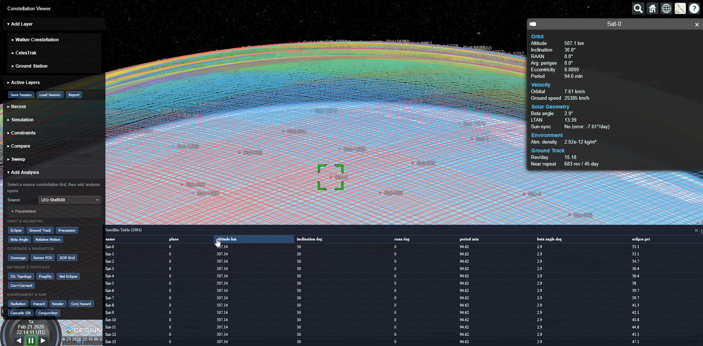
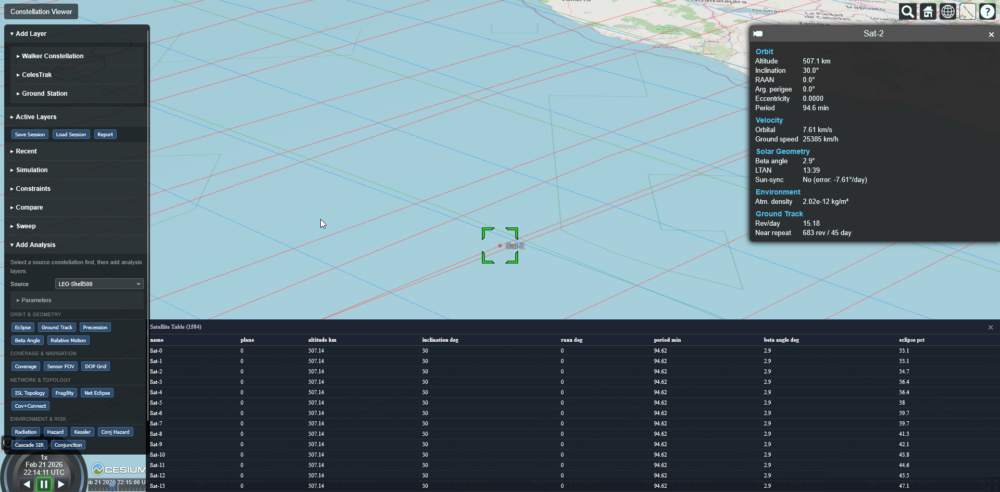
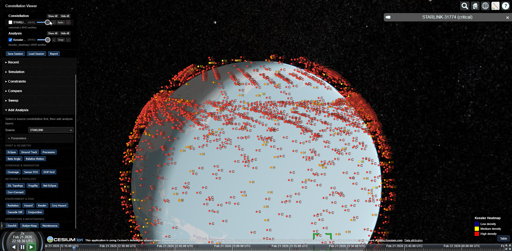
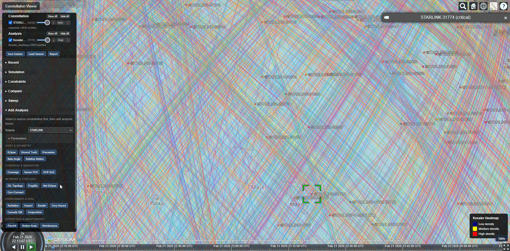

# Humeris

[](packages/core/pyproject.toml) [](packages/core/pyproject.toml) [](tests/) [-green.svg)](LICENSE) [-red.svg)](COMMERCIAL-LICENSE.md) [](docs/architecture.md)

A Python library for satellite constellation analysis — from generating
Walker shells to propagating orbits, screening conjunctions, and
visualizing everything on a 3D globe. Pure Python, no compiled extensions.



## What it does

- **Constellation generation** — Walker shells with configurable altitude, inclination, planes, phasing
- **Orbit propagation** — Keplerian, J2/J3 secular, RK4/Dormand-Prince numerical with pluggable forces (drag, SRP, third-body, relativistic, tidal, albedo)
- **Live data** — fetch real satellites from CelesTrak (TLE/OMM, SGP4 propagation)
- **Coverage and access** — grid-based coverage snapshots, revisit time, access window prediction
- **Conjunction screening** — close-approach detection, B-plane geometry, collision probability
- **Orbit design** — sun-synchronous, frozen, repeat ground track orbits
- **Environment modeling** — atmospheric drag (NRLMSISE-00), orbit lifetime, station-keeping budgets, eclipse, radiation
- **Network topology** — inter-satellite links, link budgets, Hodge Laplacian spectral analysis
- **Orbit determination** — EKF state estimation, maneuver detection (CUSUM/EWMA), hazard reporting
- **Export everywhere** — CSV, GeoJSON, CZML, KML, Celestia, Blender, SpaceEngine, KSP, Universe Sandbox, Stellarium
- **Interactive 3D viewer** — built-in CesiumJS viewer with 21 analysis layer types



> **Disclaimer**: This library provides computational models for educational,
> research, and engineering analysis purposes. It is not certified for
> operational mission planning, safety-of-flight decisions, or regulatory
> compliance. All models are simplified approximations — results should be
> independently validated before operational use. See [LICENSE](LICENSE) and
> [COMMERCIAL-LICENSE.md](COMMERCIAL-LICENSE.md).

## Install

```bash
pip install humeris-core          # MIT core (constellation, propagation, coverage, export)
pip install humeris-pro           # full suite (core + 71 analysis modules)
```

Python 3.11, 3.12, 3.13. Linux, macOS, Windows. See
[Getting Started](docs/getting-started.md) for all install options including
Windows executable and development setup.

## Quick look

```bash
humeris serve                                                      # 3D viewer at localhost:8765
humeris generate -i sim.json -o out.json --live-group GPS-OPS      # live GPS constellation
humeris generate -i sim.json -o out.json --export-csv sats.csv     # export to CSV
humeris import opm satellite.opm                                   # CCSDS orbit data
humeris sweep --param alt:400:600:50 --metric coverage -o sweep.csv
```

```python
from humeris.domain.constellation import ShellConfig, generate_walker_shell

shell = ShellConfig(
    altitude_km=550, inclination_deg=53,
    num_planes=10, sats_per_plane=20,
    phase_factor=1, raan_offset_deg=0,
    shell_name="LEO-550",
)
satellites = generate_walker_shell(shell)   # 200 satellites, deterministic
```

More in the [Python API examples](docs/python-api.md) and the
[CLI reference](docs/getting-started.md#cli-reference).

## Checking our work

We test against Vallado's textbook values, the SGP4 propagator, IGS SP3
precise ephemerides, and archived GMAT scenario outputs. Six historical
spaceflight events (ISS, Starlink, Tiangong-1, ENVISAT, 'Oumuamua,
Iridium 33/Cosmos 2251) serve as real-world cross-checks. Internal
invariant suites verify energy conservation, angular momentum, vis-viva
identity, and coordinate frame round-trips.

The comparison artifacts — including cases where our results are imperfect
or still evolving — are published alongside the code.





Details: [Validation](docs/validation.md)

## Documentation

**Start here**
- [Getting Started](docs/getting-started.md) — install, quickstart, CLI reference
- [Python API Examples](docs/python-api.md) — worked examples for every module

**Usage guides**
- [Examples](examples/) — trade study script, pre-generated simulator files
- [Simulation JSON](docs/simulation-json.md) — input/output schema
- [Viewer Server](docs/viewer-server.md) — interactive 3D viewer, 21 analysis types
- [Export Formats](docs/export-formats.md) — CSV, GeoJSON, CZML
- [Simulator Integrations](docs/simulator-integrations.md) — Universe Sandbox, SpaceEngine, KSP, Celestia, Google Earth, Blender, Stellarium
- [Trade Study Guide](docs/trade-study-guide.md) — Pareto optimization, conjunction screening

**Reference**
- [Architecture](docs/architecture.md) — hexagonal design, package layout, domain purity
- [API Reference](docs/api-reference.md) — viewer HTTP endpoints
- [Integration Guide](docs/integration-guide.md) — CelesTrak, CesiumJS, custom sources, reproducibility
- [Validation](docs/validation.md) — reference tests, GMAT parity, determinism
- [Research Algorithms](docs/research_algorithms.md) — cross-domain algorithms and research papers
- [Licensing](docs/licensing.md) — MIT core + commercial extensions
- [Changelog](CHANGELOG.md) — version history

## Origins

Humeris started as a rewrite of `generate_shells.py`, a Walker constellation
generator script by [Scott Manley](https://www.youtube.com/@scottmanley) that
produces satellite shells for orbit simulation tools. That original script —
Keplerian-to-Cartesian conversion, Walker phasing, and SSO band generation in
~175 lines of pure Python — remains the conceptual seed. The library has since
grown into 82 domain modules covering propagation, conjunction analysis, orbit
design, link budgets, environmental modeling, and interactive 3D visualization.

## Credits

Written by Claude and Codex, directed by Jeroen Visser. Inspired by Scott
Manley's orbital mechanics visualizations.

## License

**MIT** — the core foundation (11 domain modules, 13 adapters, CLI).
See [LICENSE](LICENSE).

**Commercial** — 71 extended analysis modules and the interactive viewer.
Free for personal, educational, and academic use. Commercial use requires
a paid license. See [COMMERCIAL-LICENSE.md](COMMERCIAL-LICENSE.md) and
[Licensing](docs/licensing.md) for details.
