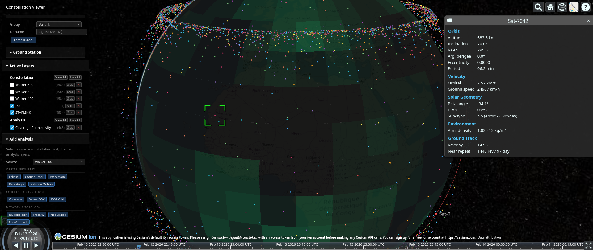

# Humeris

[](packages/core/pyproject.toml)
[](packages/core/pyproject.toml)
[](tests/)
[-green.svg)](LICENSE)

Generate Walker constellation satellite shells and fetch live orbital data for orbit simulation tools.



> **Disclaimer**: This library provides computational models for educational,
> research, and engineering analysis purposes. It is **not certified** for
> operational mission planning, safety-of-flight decisions, or regulatory
> compliance determination. All models are simplified approximations —
> results must be independently validated before use in any operational context.
> See the warranty disclaimer in [LICENSE](LICENSE) and
> [COMMERCIAL-LICENSE.md](COMMERCIAL-LICENSE.md).

## Install

```bash
# Core MIT package (constellation generation, propagation, coverage, export)
pip install humeris-core

# With live CelesTrak support
pip install "humeris-core[live]"

# Full suite (core + 66 commercial analysis modules)
pip install humeris-pro

# Development (editable, from repo)
pip install -e ./packages/core -e ./packages/pro
```

**Python**: 3.11, 3.12, 3.13. **Platforms**: Linux, macOS, Windows (pure Python, no compiled extensions).

## Usage

### Synthetic constellations (Walker shells)

```bash
# Default: 3 Walker shells + SSO band → 7200 satellites
humeris -i simulation_old.json -o simulation.json

# Custom base ID
humeris -i sim_old.json -o sim.json --base-id 200
```

### Live data from CelesTrak

```bash
# Real GPS constellation (32 satellites)
humeris -i sim.json -o out.json --live-group GPS-OPS

# All Starlink satellites (~6000+) with concurrent SGP4 propagation
humeris -i sim.json -o out.json --live-group STARLINK --concurrent

# Search by name
humeris -i sim.json -o out.json --live-name "ISS (ZARYA)"

# By NORAD catalog number
humeris -i sim.json -o out.json --live-catnr 25544
```

#### Available CelesTrak groups

`STATIONS`, `GPS-OPS`, `STARLINK`, `ONEWEB`, `ACTIVE`, `WEATHER`,
`GALILEO`, `BEIDOU`, `IRIDIUM-NEXT`, `PLANET`, `SPIRE`, `GEO`,
`INTELSAT`, `SES`, `TELESAT`, `AMATEUR`, `SCIENCE`, `NOAA`, `GOES`

### Export formats

Export satellite positions as geodetic coordinates (lat/lon/alt) alongside
the simulation JSON:

```bash
# CSV export
humeris -i sim.json -o out.json --export-csv satellites.csv

# GeoJSON export
humeris -i sim.json -o out.json --export-geojson satellites.geojson

# Both at once
humeris -i sim.json -o out.json --export-csv sats.csv --export-geojson sats.geojson
```

CSV columns: `name`, `lat_deg`, `lon_deg`, `alt_km`, `epoch`, `plane_index`,
`sat_index`, `raan_deg`, `true_anomaly_deg`, `altitude_km`, `inclination_deg`,
`orbital_period_min`, `beta_angle_deg`, `atmospheric_density_kg_m3`, `l_shell`.

GeoJSON produces a FeatureCollection with Point geometries. Coordinates
follow the GeoJSON spec: `[longitude, latitude, altitude_km]`. Properties
include the same orbital analysis fields as CSV.

### Simulator exports

Export directly to 3D space simulators, game engines, and planetarium software:

```bash
humeris -i sim.json -o out.json --export-celestia sats.ssc      # Celestia
humeris -i sim.json -o out.json --export-kml sats.kml            # Google Earth
humeris -i sim.json -o out.json --export-tle sats.tle            # Stellarium / STK / GMAT
humeris -i sim.json -o out.json --export-blender sats.py         # Blender
humeris -i sim.json -o out.json --export-spaceengine sats.sc     # SpaceEngine
humeris -i sim.json -o out.json --export-ksp sats.sfs            # Kerbal Space Program
humeris -i sim.json -o out.json --export-ubox sats.ubox          # Universe Sandbox
```

Optional visual layer flags:

```bash
--no-orbits          # Omit orbit path lines from KML and Blender exports
--kml-planes         # Organize KML by orbital plane folders
--kml-isl            # Include ISL topology lines in KML export
--blender-colors     # Color-code satellites by orbital plane in Blender export
```

All exporters include orbital analysis data (altitude, inclination, period,
beta angle, atmospheric density, L-shell) computed from the satellite state
vectors. See [Simulator Integrations](docs/simulator-integrations.md) for
setup instructions per tool.

### Programmatic

#### Walker shell generation

```python
from humeris.domain.constellation import ShellConfig, generate_walker_shell

shell = ShellConfig(
    altitude_km=550, inclination_deg=53,
    num_planes=10, sats_per_plane=20,
    phase_factor=1, raan_offset_deg=0,
    shell_name="Custom-Shell",
)
satellites = generate_walker_shell(shell)
```

#### Live data from CelesTrak

```python
from humeris.adapters.celestrak import CelesTrakAdapter

celestrak = CelesTrakAdapter()
gps_sats = celestrak.fetch_satellites(group="GPS-OPS")
iss = celestrak.fetch_satellites(name="ISS (ZARYA)")
```

#### Concurrent mode

SGP4 propagation is the bottleneck when fetching large groups (not HTTP).
`ConcurrentCelesTrakAdapter` parallelizes propagation across threads
using `ThreadPoolExecutor`:

```python
from humeris.adapters.concurrent_celestrak import ConcurrentCelesTrakAdapter

concurrent = ConcurrentCelesTrakAdapter(max_workers=16)
starlink = concurrent.fetch_satellites(group="STARLINK")
```

#### Coordinate frames

ECI to ECEF conversion applies a Z-axis rotation by the Greenwich Mean
Sidereal Time (GMST) angle. ECEF to Geodetic uses the iterative Bowring
method on the WGS84 ellipsoid:

```python
from datetime import datetime, timezone
from humeris.domain.coordinate_frames import gmst_rad, eci_to_ecef, ecef_to_geodetic

sat = gps_sats[0]
gmst = gmst_rad(sat.epoch)
pos_ecef, vel_ecef = eci_to_ecef(sat.position_eci, sat.velocity_eci, gmst)
lat, lon, alt = ecef_to_geodetic(pos_ecef)
print(f"{sat.name}: {lat:.4f}°N, {lon:.4f}°E, {alt/1000:.1f} km")
```

#### Ground track

Compute the sub-satellite ground track over time using Keplerian two-body
propagation, optionally with J2 secular perturbations. Appropriate for
synthetic Walker shell satellites. For TLE data, SGP4 propagation via
the adapter layer provides SGP4-based propagation.

```python
from datetime import datetime, timedelta, timezone
from humeris.domain.constellation import ShellConfig, generate_walker_shell
from humeris.domain.ground_track import compute_ground_track

shell = ShellConfig(
    altitude_km=500, inclination_deg=53,
    num_planes=2, sats_per_plane=3,
    phase_factor=1, raan_offset_deg=0,
    shell_name="Demo",
)
sats = generate_walker_shell(shell)

start = datetime(2026, 3, 20, 12, 0, 0, tzinfo=timezone.utc)
track = compute_ground_track(sats[0], start, timedelta(minutes=90), timedelta(minutes=1))
track_j2 = compute_ground_track(sats[0], start, timedelta(hours=6), timedelta(minutes=1), include_j2=True)
print(f"Ground track: {len(track)} points")
print(f"Ground track (J2): {len(track_j2)} points")
```

#### Topocentric observation

Compute azimuth, elevation, and slant range from a ground station to a
satellite:

```python
from humeris.domain.constellation import ShellConfig, generate_walker_shell
from humeris.domain.propagation import derive_orbital_state, propagate_ecef_to
from humeris.domain.observation import GroundStation, compute_observation
from datetime import datetime, timezone

shell = ShellConfig(altitude_km=500, inclination_deg=53, num_planes=1,
                    sats_per_plane=1, phase_factor=0, raan_offset_deg=0, shell_name="Demo")
sat = generate_walker_shell(shell)[0]
epoch = datetime(2026, 3, 20, 12, 0, 0, tzinfo=timezone.utc)

station = GroundStation(name="Delft", lat_deg=52.0, lon_deg=4.4, alt_m=0.0)
state = derive_orbital_state(sat, epoch)
sat_ecef = propagate_ecef_to(state, epoch)
obs = compute_observation(station, sat_ecef)
print(f"Az={obs.azimuth_deg:.1f}°, El={obs.elevation_deg:.1f}°, Range={obs.slant_range_m/1000:.0f} km")
```

#### Access windows

Predict satellite visibility windows (rise/set times) from a ground station:

```python
from humeris.domain.constellation import ShellConfig, generate_walker_shell
from humeris.domain.propagation import derive_orbital_state
from humeris.domain.observation import GroundStation
from humeris.domain.access_windows import compute_access_windows
from datetime import datetime, timedelta, timezone

shell = ShellConfig(altitude_km=420, inclination_deg=51.6, num_planes=1,
                    sats_per_plane=1, phase_factor=0, raan_offset_deg=0, shell_name="ISS-like")
sat = generate_walker_shell(shell)[0]
epoch = datetime(2026, 3, 20, 12, 0, 0, tzinfo=timezone.utc)

station = GroundStation(name="Delft", lat_deg=52.0, lon_deg=4.4)
state = derive_orbital_state(sat, epoch)
windows = compute_access_windows(station, state, epoch, timedelta(hours=24), timedelta(seconds=30))
for w in windows:
    print(f"Rise: {w.rise_time}, Set: {w.set_time}, Max el: {w.max_elevation_deg:.1f}°")
```

#### Coverage analysis

Compute a grid-based coverage snapshot showing how many satellites are
visible from each point:

```python
from humeris.domain.constellation import ShellConfig, generate_walker_shell
from humeris.domain.propagation import derive_orbital_state
from humeris.domain.coverage import compute_coverage_snapshot
from datetime import datetime, timezone

shell = ShellConfig(altitude_km=500, inclination_deg=53, num_planes=6,
                    sats_per_plane=10, phase_factor=1, raan_offset_deg=0, shell_name="Constellation")
sats = generate_walker_shell(shell)
epoch = datetime(2026, 3, 20, 12, 0, 0, tzinfo=timezone.utc)

states = [derive_orbital_state(s, epoch) for s in sats]
grid = compute_coverage_snapshot(states, epoch, lat_step_deg=10, lon_step_deg=10)
max_vis = max(p.visible_count for p in grid)
print(f"Grid: {len(grid)} points, max visible: {max_vis}")
```

#### Revisit time analysis

Compute time-domain coverage FoMs (mean/max revisit, coverage fraction,
mean response time) over an analysis window:

```python
from humeris.domain.constellation import ShellConfig, generate_walker_shell
from humeris.domain.propagation import derive_orbital_state
from humeris.domain.revisit import compute_revisit
from datetime import datetime, timedelta, timezone

shell = ShellConfig(altitude_km=550, inclination_deg=53, num_planes=6,
                    sats_per_plane=10, phase_factor=1, raan_offset_deg=0, shell_name="Test")
sats = generate_walker_shell(shell)
epoch = datetime(2026, 3, 20, 12, 0, 0, tzinfo=timezone.utc)

states = [derive_orbital_state(s, epoch) for s in sats]
result = compute_revisit(
    states, epoch, timedelta(hours=24), timedelta(seconds=60),
    min_elevation_deg=10, lat_step_deg=10, lon_step_deg=10,
)
print(f"Mean coverage: {result.mean_coverage_fraction:.1%}")
print(f"Max revisit: {result.max_revisit_s/60:.0f} min")
print(f"Mean response time: {result.mean_response_time_s/60:.0f} min")
```

#### Parametric trade studies

Sweep Walker constellation parameters and compare coverage metrics:

```python
from humeris.domain.trade_study import (
    generate_walker_configs, run_walker_trade_study, pareto_front_indices,
)
from datetime import datetime, timedelta, timezone

epoch = datetime(2026, 3, 20, 12, 0, 0, tzinfo=timezone.utc)
configs = generate_walker_configs(
    altitude_range=(500.0, 600.0),
    inclination_range=(53.0,),
    planes_range=(4, 6),
    sats_per_plane_range=(8,),
)
result = run_walker_trade_study(
    configs, epoch, timedelta(hours=6), timedelta(seconds=120),
    min_elevation_deg=10, lat_step_deg=20, lon_step_deg=20,
)
for pt in result.points:
    print(f"  {pt.config.altitude_km}km, {pt.config.num_planes}P: "
          f"max_revisit={pt.coverage.max_revisit_s/60:.0f}min, "
          f"coverage={pt.coverage.mean_coverage_fraction:.1%}, "
          f"sats={pt.total_satellites}")

costs = [float(pt.total_satellites) for pt in result.points]
metrics = [pt.coverage.max_revisit_s for pt in result.points]
front = pareto_front_indices(costs, metrics)
print(f"Pareto front: {len(front)} points")
```

#### Atmospheric drag and orbit lifetime

Model atmospheric density, compute orbit lifetime under drag decay,
and predict altitude at future times:

```python
from humeris.domain.atmosphere import DragConfig, atmospheric_density
from humeris.domain.lifetime import compute_orbit_lifetime, compute_altitude_at_time
from humeris.domain.orbital_mechanics import OrbitalConstants
from datetime import datetime, timedelta, timezone

drag = DragConfig(cd=2.2, area_m2=10.0, mass_kg=260.0)
print(f"B_c = {drag.ballistic_coefficient:.4f} m²/kg")
print(f"Density at 550 km: {atmospheric_density(550.0):.3e} kg/m³")

epoch = datetime(2026, 3, 20, 12, 0, 0, tzinfo=timezone.utc)
a = OrbitalConstants.R_EARTH + 550_000
result = compute_orbit_lifetime(a, 0.0, drag, epoch)
print(f"Lifetime at 550 km: {result.lifetime_days:.0f} days ({result.lifetime_days/365.25:.1f} yr)")
print(f"Converged: {result.converged}, profile points: {len(result.decay_profile)}")

alt_1yr = compute_altitude_at_time(a, 0.0, drag, epoch, epoch + timedelta(days=365))
print(f"Altitude after 1 year: {alt_1yr:.1f} km")
```

#### Station-keeping delta-V budgets

Compute annual delta-V for drag compensation and plane maintenance,
total propellant budget, and operational lifetime:

```python
from humeris.domain.station_keeping import StationKeepingConfig, compute_station_keeping_budget
from humeris.domain.atmosphere import DragConfig

drag = DragConfig(cd=2.2, area_m2=10.0, mass_kg=260.0)
config = StationKeepingConfig(
    target_altitude_km=550, inclination_deg=53,
    drag_config=drag, isp_s=300,
    dry_mass_kg=250, propellant_mass_kg=10,
)
budget = compute_station_keeping_budget(config)
print(f"Drag ΔV: {budget.drag_dv_per_year_ms:.2f} m/s/yr")
print(f"Plane ΔV: {budget.plane_dv_per_year_ms:.2f} m/s/yr")
print(f"Total ΔV capacity: {budget.total_dv_capacity_ms:.1f} m/s")
print(f"Operational lifetime: {budget.operational_lifetime_years:.1f} yr")
```

#### Conjunction screening and collision probability

Screen a constellation for close approaches, refine TCA, compute
B-plane geometry and collision probability.

> **Note**: Collision probability estimates use simplified covariance models.
> Operational conjunction assessment requires authoritative ephemeris data
> (e.g., from 18th Space Defense Squadron) and validated covariance realism.

```python
from humeris.domain.conjunction import screen_conjunctions, assess_conjunction, PositionCovariance
from humeris.domain.constellation import ShellConfig, generate_walker_shell
from humeris.domain.propagation import derive_orbital_state
from datetime import datetime, timedelta, timezone

epoch = datetime(2026, 3, 20, 12, 0, 0, tzinfo=timezone.utc)
shell = ShellConfig(altitude_km=550, inclination_deg=53, num_planes=6,
                    sats_per_plane=10, phase_factor=1, raan_offset_deg=0, shell_name="Test")
sats = generate_walker_shell(shell)
states = [derive_orbital_state(s, reference_epoch=epoch) for s in sats]
names = [s.name for s in sats]

events = screen_conjunctions(states, names, epoch, timedelta(hours=2),
                             timedelta(seconds=30), distance_threshold_m=100_000)
print(f"Conjunction candidates in 2h: {len(events)}")
if events:
    i, j, t, d = events[0]
    event = assess_conjunction(states[i], names[i], states[j], names[j], t)
    print(f"Closest: {event.miss_distance_m:.0f} m between {event.sat1_name} and {event.sat2_name}")
```

#### Solar ephemeris

Compute Sun position in ECI coordinates at any epoch:

```python
from humeris.domain.solar import sun_position_eci, solar_declination_rad
from datetime import datetime, timezone
import math

epoch = datetime(2026, 3, 20, 12, 0, 0, tzinfo=timezone.utc)
sun = sun_position_eci(epoch)
print(f"Sun RA={math.degrees(sun.right_ascension_rad):.1f}°, Dec={math.degrees(sun.declination_rad):.1f}°")
print(f"Distance: {sun.distance_m/1.496e11:.4f} AU")
```

#### Eclipse prediction

Determine shadow conditions, beta angle, and eclipse windows:

```python
from humeris.domain.eclipse import eclipse_fraction, compute_beta_angle, compute_eclipse_windows
from humeris.domain.constellation import ShellConfig, generate_walker_shell
from humeris.domain.propagation import derive_orbital_state
from datetime import datetime, timedelta, timezone
import math

shell = ShellConfig(altitude_km=500, inclination_deg=53, num_planes=1,
                    sats_per_plane=1, phase_factor=0, raan_offset_deg=0, shell_name="Test")
sat = generate_walker_shell(shell)[0]
epoch = datetime(2026, 3, 20, 12, 0, 0, tzinfo=timezone.utc)
state = derive_orbital_state(sat, epoch)

frac = eclipse_fraction(state, epoch)
print(f"Eclipse fraction: {frac:.1%}")

beta = compute_beta_angle(state.raan_rad, state.inclination_rad, epoch)
print(f"Beta angle: {beta:.1f}°")

windows = compute_eclipse_windows(state, epoch, timedelta(hours=3), timedelta(seconds=30))
print(f"Eclipse events in 3h: {len(windows)}")
```

#### Orbit transfer maneuvers

Plan Hohmann, bi-elliptic, plane change, and phasing maneuvers:

```python
from humeris.domain.maneuvers import (
    hohmann_transfer, bielliptic_transfer, plane_change_dv, add_propellant_estimate,
)
from humeris.domain.orbital_mechanics import OrbitalConstants
import math

R_E = OrbitalConstants.R_EARTH
r_leo = R_E + 400_000
r_geo = R_E + 35_786_000

plan = hohmann_transfer(r_leo, r_geo)
print(f"LEO→GEO: {plan.total_delta_v_ms:.0f} m/s, {plan.transfer_time_s/3600:.1f} h")

plan_prop = add_propellant_estimate(plan, isp_s=300, dry_mass_kg=500)
print(f"Propellant: {plan_prop.propellant_mass_kg:.1f} kg")

dv_plane = plane_change_dv(7500, math.radians(28.5))
print(f"28.5° plane change: {dv_plane:.0f} m/s")
```

#### Deorbit lifetime estimation

Estimate orbit decay timelines against FCC 5-year / ESA 25-year guidelines:

> **Note**: These are engineering estimates based on simplified atmospheric
> models, not regulatory compliance determinations. Actual compliance
> assessment requires mission-specific analysis with validated tools.

```python
from humeris.domain.atmosphere import DragConfig
from humeris.domain.deorbit import assess_deorbit_compliance, DeorbitRegulation
from datetime import datetime, timezone

epoch = datetime(2026, 1, 1, tzinfo=timezone.utc)
drag = DragConfig(cd=2.2, area_m2=4.0, mass_kg=400.0)

result = assess_deorbit_compliance(800, drag, epoch, isp_s=300, dry_mass_kg=390)
print(f"Compliant: {result.compliant}, lifetime: {result.natural_lifetime_days:.0f} d")
if result.maneuver_required:
    print(f"Deorbit ΔV: {result.deorbit_delta_v_ms:.1f} m/s")
    print(f"Propellant: {result.propellant_mass_kg:.2f} kg")
```

#### Orbit design

Design sun-synchronous, frozen, and repeat ground track orbits:

```python
from humeris.domain.orbit_design import (
    design_sso_orbit, design_frozen_orbit, design_repeat_ground_track,
)
from datetime import datetime, timezone

epoch = datetime(2026, 3, 20, 12, 0, 0, tzinfo=timezone.utc)

sso = design_sso_orbit(500, 10.5, epoch)
print(f"SSO 500km LTAN 10:30: inc={sso.inclination_deg:.1f}°, RAAN={sso.raan_deg:.1f}°")

frozen = design_frozen_orbit(800, 98.6)
print(f"Frozen 800km: e={frozen.eccentricity:.6f}, ω={frozen.arg_perigee_deg}°")

rgt = design_repeat_ground_track(97.0, 1, 15)
print(f"Repeat GT 1d/15rev: alt={rgt.altitude_km:.1f} km")
```

#### Numerical propagation (RK4 + pluggable force models)

Numerical orbit propagation (RK4) with composable perturbation forces:

```python
from datetime import datetime, timedelta, timezone
from humeris.domain.constellation import ShellConfig, generate_walker_shell
from humeris.domain.propagation import derive_orbital_state
from humeris.domain.numerical_propagation import (
    TwoBodyGravity, J2Perturbation, J3Perturbation,
    AtmosphericDragForce, SolarRadiationPressureForce, propagate_numerical,
)
from humeris.domain.atmosphere import DragConfig

epoch = datetime(2026, 3, 20, 12, 0, 0, tzinfo=timezone.utc)
shell = ShellConfig(altitude_km=500, inclination_deg=53, num_planes=1,
                    sats_per_plane=1, phase_factor=0, raan_offset_deg=0, shell_name="Test")
sat = generate_walker_shell(shell)[0]
state = derive_orbital_state(sat, epoch)

# Two-body + J2 + J3
result = propagate_numerical(
    state, timedelta(hours=2), timedelta(seconds=30),
    [TwoBodyGravity(), J2Perturbation(), J3Perturbation()],
)
print(f"Steps: {len(result.steps)}")

# With drag
drag = DragConfig(cd=2.2, area_m2=10.0, mass_kg=400.0)
result_drag = propagate_numerical(
    state, timedelta(hours=2), timedelta(seconds=30),
    [TwoBodyGravity(), J2Perturbation(), AtmosphericDragForce(drag)],
)

# With SRP
result_srp = propagate_numerical(
    state, timedelta(hours=2), timedelta(seconds=30),
    [TwoBodyGravity(), SolarRadiationPressureForce(cr=1.5, area_m2=10.0, mass_kg=400.0)],
)
```

#### Configurable atmosphere model

Select between atmosphere density tables:

```python
from humeris.domain.atmosphere import atmospheric_density, AtmosphereModel

rho_high = atmospheric_density(500, AtmosphereModel.HIGH_ACTIVITY)
rho_vallado = atmospheric_density(500, AtmosphereModel.VALLADO_4TH)
print(f"500km density: high={rho_high:.3e}, vallado={rho_vallado:.3e}")
```

#### CZML export (CesiumJS visualization)

Generate CZML for animated 3D visualization in CesiumJS:

```python
from datetime import datetime, timedelta, timezone
from humeris.domain.constellation import ShellConfig, generate_walker_shell
from humeris.domain.propagation import derive_orbital_state
from humeris.adapters.czml_exporter import (
    constellation_packets, ground_track_packets, coverage_packets, write_czml,
)

epoch = datetime(2026, 3, 20, 12, 0, 0, tzinfo=timezone.utc)
shell = ShellConfig(altitude_km=550, inclination_deg=53, num_planes=6,
                    sats_per_plane=10, phase_factor=1, raan_offset_deg=0, shell_name="Test")
sats = generate_walker_shell(shell)
states = [derive_orbital_state(s, epoch) for s in sats]

# Animated satellite orbits
packets = constellation_packets(states, epoch, timedelta(hours=2), timedelta(seconds=60))
write_czml(packets, "constellation.czml")

# Ground track polyline
from humeris.domain.ground_track import compute_ground_track
track = compute_ground_track(sats[0], epoch, timedelta(minutes=90), timedelta(minutes=1))
gt_packets = ground_track_packets(track)
write_czml(gt_packets, "ground_track.czml")

# Coverage heatmap
from humeris.domain.coverage import compute_coverage_snapshot
grid = compute_coverage_snapshot(states, epoch, lat_step_deg=5, lon_step_deg=5)
cov_packets = coverage_packets(grid, lat_step_deg=5, lon_step_deg=5)
write_czml(cov_packets, "coverage.czml")
```

#### Interactive Cesium viewer

Launch an interactive 3D viewer with on-demand analysis layers:

```bash
# Interactive server mode (opens browser)
python view_constellation.py --serve

# Custom port
python view_constellation.py --serve --port 9000

# Static HTML mode (generates constellation_viewer.html, no server needed)
python view_constellation.py

# Static + auto-open in browser
python view_constellation.py --open
```

**Server mode** pre-loads three Walker shells (500/450/400 km, 1584 sats each)
and live ISS data from CelesTrak. The browser UI supports adding/removing
constellations, ground stations, and 15 analysis layer types via the API.

**Static mode** generates a self-contained HTML file (~10 MB) with baked-in
CZML data. No server required — just open the file in a browser.

##### Analysis layer types

The viewer dispatches 15 analysis types, each with sensible defaults:

| Type | Visualization | Default parameters |
|------|---------------|--------------------|
| `eclipse` | Satellite color: sunlit (green) / penumbra (orange) / umbra (red) | 2h duration, 60s step |
| `coverage` | Ground heatmap colored by visible satellite count | 10° grid, 10° min elevation |
| `ground_track` | Sub-satellite polyline trace | First satellite, 2h duration |
| `sensor` | Ground-level FOV ellipses tracking sub-satellite point | 30° circular half-angle |
| `isl` | Satellite points + ISL polylines colored by SNR | Ka-band (26 GHz), 5000 km range, 100-sat cap |
| `fragility` | Satellites colored by spectral fragility index | Ka-band, control horizon = 1 orbital period, 100-sat cap |
| `hazard` | Satellites fade green→red over projected lifetime | Cd=2.2, A=0.01 m², m=4 kg; duration = ½ lifetime capped 1 yr, daily steps |
| `network_eclipse` | ISL links colored by endpoint eclipse state | Ka-band, 5000 km range, 100-sat cap |
| `coverage_connectivity` | Ground rectangles colored by coverage × Fiedler value | Ka-band, 10° grid, 100-sat cap |
| `precession` | J2 RAAN drift over extended timeline | 7-day duration, 15-min step, 24-sat cap |
| `conjunction` | Two-satellite close approach replay with proximity line | states[0] vs states[n/2], ±30 min window, 10s step |
| `kessler_heatmap` | Altitude × inclination debris density grid | 200-2000 km, 0-180°, 50 km × 10° bins |
| `conjunction_hazard` | Conjunction screening with NASA-STD-8719.14 hazard levels | 2h window, 100 km threshold, color by ROUTINE/WARNING/CRITICAL |
| `ground_station` | Station marker + visibility circle + access tracks | 10° min elevation |
| `ground_track` | Sub-satellite ground trace polyline | First satellite, 2h |

##### Default RF link configuration (Ka-band)

Used by ISL, fragility, network eclipse, and coverage-connectivity layers:

| Parameter | Value |
|-----------|-------|
| Frequency | 26 GHz |
| Transmit power | 10 W |
| Tx/Rx antenna gain | 35 dBi |
| System noise temp | 500 K |
| Bandwidth | 100 MHz |
| Additional losses | 2 dB |
| Required SNR | 10 dB |

##### Performance caps

O(n²) analyses cap satellite count to prevent browser lockup:

| Cap | Value | Applies to |
|-----|-------|------------|
| `_MAX_TOPOLOGY_SATS` | 100 | ISL, fragility, network eclipse, coverage-connectivity |
| `_MAX_PRECESSION_SATS` | 24 | Precession (7-day propagation) |

#### Export formats (programmatic)

```python
from humeris.adapters.csv_exporter import CsvSatelliteExporter
from humeris.adapters.geojson_exporter import GeoJsonSatelliteExporter

# CSV
CsvSatelliteExporter().export(sats, "satellites.csv")

# GeoJSON
GeoJsonSatelliteExporter().export(sats, "satellites.geojson")
```

Simulator exporters:

```python
from humeris.adapters.celestia_exporter import CelestiaExporter
from humeris.adapters.kml_exporter import KmlExporter
from humeris.adapters.ubox_exporter import UboxExporter

CelestiaExporter().export(sats, "constellation.ssc")
KmlExporter().export(sats, "constellation.kml")
UboxExporter().export(sats, "constellation.ubox")

# KML with visual layer options
KmlExporter(include_orbits=False, include_planes=True).export(sats, "planes.kml")
```

#### Mixing sources

Combine synthetic and live satellites, then serialise for simulation:

```python
from humeris.domain.serialization import build_satellite_entity

template = {"Name": "Sat", "Id": 0}
all_sats = satellites + gps_sats
entities = [
    build_satellite_entity(s, template, base_id=100 + i)
    for i, s in enumerate(all_sats)
]
```

## Default Shell Configuration

| Shell | Altitude | Inclination | Planes × Sats | Phase Factor |
|-------|----------|-------------|----------------|--------------|
| LEO-Shell500 | 500 km | 30° | 22 × 72 | 17 |
| LEO-Shell450 | 450 km | 30° | 22 × 72 | 17 |
| LEO-Shell400 | 400 km | 30° | 22 × 72 | 17 |
| SSO Band | 525–2200 km (50 km step) | SSO-computed | 1 × 72 | 0 |

## Architecture

Two pip-installable packages share the `humeris` namespace via PEP 420
implicit namespace packages. Import paths are unchanged:
`from humeris.domain.constellation import Satellite`.

```
packages/
├── core/                            # humeris-core (MIT)
│   ├── pyproject.toml
│   ├── LICENSE                      # MIT
│   └── src/humeris/                 # NO __init__.py (namespace package)
│       ├── cli.py                   # CLI entry point
│       ├── domain/                  # 10 MIT domain modules
│       │   ├── orbital_mechanics.py
│       │   ├── constellation.py
│       │   ├── coordinate_frames.py
│       │   ├── propagation.py
│       │   ├── coverage.py
│       │   ├── access_windows.py
│       │   ├── ground_track.py
│       │   ├── observation.py
│       │   ├── omm.py
│       │   └── serialization.py
│       ├── ports/                   # Protocol interfaces
│       │   ├── __init__.py
│       │   ├── export.py
│       │   └── orbital_data.py
│       └── adapters/                # 13 MIT adapters
│           ├── json_io.py
│           ├── enrichment.py
│           ├── csv_exporter.py
│           ├── geojson_exporter.py
│           ├── celestrak.py
│           ├── concurrent_celestrak.py
│           ├── kml_exporter.py
│           ├── blender_exporter.py
│           ├── stellarium_exporter.py
│           ├── celestia_exporter.py
│           ├── spaceengine_exporter.py
│           ├── ksp_exporter.py
│           └── ubox_exporter.py
└── pro/                             # humeris-pro (Commercial)
    ├── pyproject.toml
    ├── LICENSE                      # Commercial
    └── src/humeris/                 # NO __init__.py (namespace package)
        ├── domain/                  # 66 commercial domain modules
        │   ├── numerical_propagation.py, adaptive_integration.py, ...
        │   ├── conjunction.py, eclipse.py, maneuvers.py, ...
        │   ├── orbit_design.py, trade_study.py, ...
        │   └── (full list in COMMERCIAL-LICENSE.md)
        ├── adapters/                # 4 commercial adapters
        │   ├── czml_exporter.py
        │   ├── czml_visualization.py
        │   ├── cesium_viewer.py
        │   └── viewer_server.py
        └── data/                    # Reference data files
            └── *.json (8 files)
```

The domain layer depends only on Python stdlib and NumPy. All I/O (file access,
HTTP, SGP4 propagation, export) is confined to the adapter layer behind
port interfaces.

## Tests

```bash
pytest                           # all 3158 tests (offline, no network required)
pytest tests/test_live_data.py   # live CelesTrak tests (requires network)
```

The test suite covers all 76 domain modules (10 core + 66 commercial), 6 invariant
test suites, adapter tests, and domain purity tests (verifying no external
dependencies beyond NumPy). All tests except `test_live_data.py` run offline.

### Validated against

The library includes 100+ validation tests that cross-check results against
independent references:

- **Vallado** — Circular orbit velocities, orbital periods, Hohmann transfer
  delta-V, J2 RAAN drift rates, SSO inclinations, and atmospheric density
  values from *Fundamentals of Astrodynamics and Applications* (4th ed.)
- **SGP4** — Position, velocity, and orbital properties compared against the
  industry-standard SGP4 propagator using hardcoded ISS, GPS, and GEO OMM
  records
- **SP3 precise ephemeris** — Parser for IGS Standard Product #3 format
  (centimeter-accurate post-processed GNSS orbits), with physical consistency
  checks against known GPS constellation geometry
- **Real-world scenarios** — Six historical spaceflight events validated
  against published data:
  - *'Oumuamua* — Hyperbolic orbit math (e > 1), periapsis distance exact to
    1e-10, positive specific energy cross-checked against vis-viva
  - *ISS* — Orbital period within 0.5 min of 92.68 min, J2 RAAN drift within
    0.15 deg/day of -5.0 deg/day, revolutions/day within 0.1 of 15.54
  - *Tiangong-1* — Orbit lifetime from 340 km converges to weeks-to-months
    (actual reentry ~91 days), monotonic decay trajectory, reentry at 100 km
  - *Starlink* — Hohmann 440→550 km within 5 m/s of ~60 m/s, transfer time
    within 2 min of ~46 min, Walker shell geometry and RAAN separation exact
  - *ENVISAT* — SSO inclination at 770 km within 0.5 deg of 98.55 deg, RAAN
    drift rate within 0.02 deg/day of solar rate (0.9856 deg/day)
  - *Iridium 33 / Cosmos 2251* — Collision relative velocity within 2 km/s of
    11.7 km/s, B-plane conjunction assessment, SIR cascade debris increase,
    orbital periods within 1.5 min of ~100 min
- **Internal cross-checks** — Energy conservation, angular momentum
  invariance, vis-viva identity, coordinate frame round-trips, eclipse
  fraction vs eclipse windows agreement, J2 drift vs SSO condition
  consistency, and propagation element recovery

## Determinism and reproducibility

Understanding what is deterministic matters for research reproducibility,
simulation comparisons, and audits.

| Mode | Deterministic? | Details |
|------|----------------|---------|
| Synthetic Walker shells | Yes | Same `ShellConfig` always produces identical `Satellite` objects. Pure math, no external state. |
| Live CelesTrak (sequential) | For a given TLE set | SGP4 is deterministic. But CelesTrak updates TLEs up to every 2 hours, so re-fetching tomorrow may yield different input data. |
| Live CelesTrak (concurrent) | Same results, **different ordering** | `--concurrent` uses `as_completed()` — satellite list order depends on thread scheduling. Values are identical. |
| Numerical propagation (RK4) | Yes | Fixed-step RK4 with deterministic force models. Same initial state + same forces = same trajectory. |

**TLE epoch in outputs**: The `Satellite` domain object stores the TLE
epoch in its `epoch` field. However, the simulation JSON output
(`-o output.json`) contains only `Position` and `Velocity` strings — the
TLE epoch is **not** written to the output file. If you need epoch
traceability, use the CSV or GeoJSON exporters (which include the `epoch`
column) or save the raw OMM snapshot (see
[Integration Guide](docs/integration-guide.md#reproducibility-and-determinism)).

**Reproducing a live run**: Save the raw OMM JSON before propagation.
Replay it later with `SGP4Adapter.omm_to_satellite()` for bit-identical
results without network access.

## Documentation

- [Getting Started](docs/getting-started.md) — installation, quickstart, CLI
- [Simulation JSON](docs/simulation-json.md) — input/output JSON schema
- [Architecture](docs/architecture.md) — hexagonal design, module categories
- [Viewer Server](docs/viewer-server.md) — interactive 3D viewer, 15 analysis types
- [API Reference](docs/api-reference.md) — HTTP endpoints
- [Integration Guide](docs/integration-guide.md) — CelesTrak, CesiumJS, custom sources
- [Export Formats](docs/export-formats.md) — CSV, GeoJSON, CZML
- [Trade Study Guide](docs/trade-study-guide.md) — Pareto optimization, conjunction screening
- [Simulator Integrations](docs/simulator-integrations.md) — Universe Sandbox, SpaceEngine, KSP, Celestia, Google Earth, Blender, Stellarium
- [Licensing](docs/licensing.md) — MIT core + commercial extensions
- [Changelog](CHANGELOG.md) — version history

## Origins

Humeris started as a rewrite of `generate_shells.py`, a Walker constellation
generator script by [Scott Manley](https://www.youtube.com/@scottmanley) that
produces satellite shells for orbit simulation tools. That original script —
Keplerian-to-Cartesian conversion, Walker phasing, and SSO band generation in
~175 lines of pure Python — remains the conceptual seed. Humeris has since
grown into a full astrodynamics library: 76 domain modules (10 MIT + 66 commercial) covering
propagation, conjunction analysis, orbit design, link budgets, environmental
modeling, and interactive 3D visualization, still pure Python with no compiled
extensions.

## Credits

Written by Jeroen Visser. Inspired by Scott Manley's orbital mechanics
visualizations.

## What the commercial license provides

The commercial modules are not feature add-ons — they constitute a
**validated orbital analysis engine** built on top of the MIT core.

**Analytical + numerical models in the same codebase.** Keplerian and J2
secular propagation (MIT) alongside RK4 numerical integration with
pluggable perturbation forces (drag, SRP, third-body, J2/J3). Switch
between fast analytical estimates and high-fidelity numerical propagation
without changing your workflow.

**81 validation tests against independent references.** Cross-checked
against Vallado's textbook values, SGP4 industry-standard propagator,
and IGS SP3 precise ephemerides. Six invariant test suites verify energy
conservation, angular momentum, vis-viva identity, and coordinate frame
round-trips.

**Cross-domain composition.** The 66 commercial domain modules are
designed to compose: conjunction management chains screening into
collision probability into avoidance maneuver planning. Mission analysis
combines coverage, eclipse, link budget, and lifetime into a single
assessment. Early-warning modules chain EKF orbit determination into
maneuver detection into hazard reporting with cryptographic provenance.
These compositions encode domain knowledge that would take months to
build from scratch.

**Pure Python, zero compiled extensions.** No C dependencies, no build
toolchain, no platform-specific binaries. Runs anywhere Python runs.
Every computation is inspectable — step through the RK4 integrator or
the Jacobi eigensolver in your debugger.

**What it is not.** This library is not certified for operational flight
decisions, regulatory compliance determination, or safety-of-flight
assessment. It provides engineering analysis tools. Operational use
requires independent validation against authoritative sources.

## License

This project uses a dual-license model:

**MIT** — the core foundation (constellation generation, Keplerian+J2
propagation, coordinate frames, coverage analysis, observation geometry,
ground track, access windows, export adapters). See [`LICENSE`](LICENSE).

**Commercial** — extended modules (66 domain modules, 4 adapters, test
files) covering numerical propagation, atmospheric drag, eclipse, maneuvers,
ISL topology, link budgets, conjunction, radiation, statistical analysis,
design optimization, orbit determination, maneuver detection, hazard
reporting, Kessler density analysis, Koopman propagation, interactive viewer,
and more. Free for
personal, educational, and academic use. Commercial use requires a paid
license starting at EUR 2,000. See [`COMMERCIAL-LICENSE.md`](COMMERCIAL-LICENSE.md).
